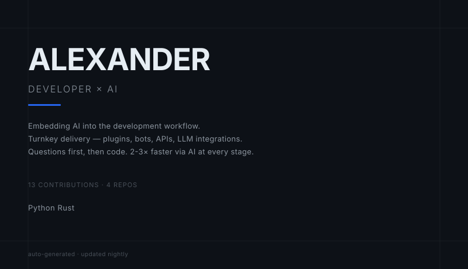

<p align="center">
  
</p>

<p align="center">
  <picture>
    <source media="(prefers-color-scheme: dark)" srcset="assets/hero-dark.svg" />
    <source media="(prefers-color-scheme: light)" srcset="assets/hero-light.svg" />
    
  </picture>
</p>

```
▸ stack    Java · Python · TypeScript · PHP · SQL
▸ builds   Minecraft plugins · TG/Discord bots · REST APIs · parsers
▸ ai       OpenAI / Claude — embeddings, agents, tool-use
▸ mode     questions → architecture → code → ship
```

<p align="center">
  
  &nbsp;
  
</p>

<br/>

<p align="center">
  <picture>
    <source media="(prefers-color-scheme: dark)" srcset="assets/snake-dark.svg" />
    <source media="(prefers-color-scheme: light)" srcset="assets/snake-light.svg" />
    
  </picture>
</p>

<br/>

```
▸ open to turnkey gigs — plugins, bots, APIs, AI integrations
▸ открыт к проектам под ключ — плагины, боты, API, AI-интеграции
```

<p align="center">
  <a href="https://kwork.ru/user/sacha_ch"></a>
</p>
